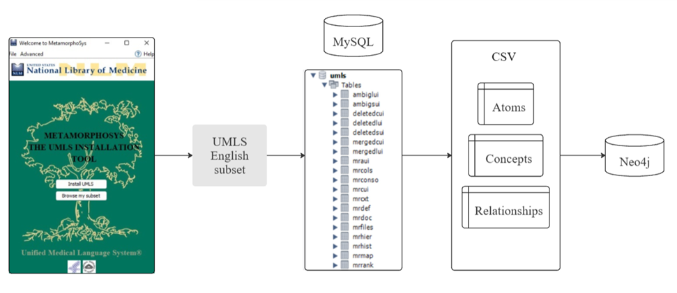

# Тема дослідження
Інтеграція великої мовної моделі і графа знань для зменшення галюцинацій у медичних відповідях.

Було реалізовано два методи Retrieval-Augmented Generation (RAG):

* RAG на основі ембедінгів (використання Sentence-BERT)

* RAG на основі ключових слів (використання KeyBert)

Отримані відповіді від кожного підходу були порівняні з відповідями базової LLM-моделі.

# Створення графа знань

Граф знань було побудовано на основі медичної онтології UMLS (Unified Medical Language System), яка забезпечує стандартизоване представлення медичних понять, синонімів та зв’язків між ними. Для реалізації графа використовувалося поєднання реляційної бази MySQL  та графової бази Neo4j .

# Створення індексів у Neo4j
Після побудови графа знань  було реалізовано два типи індексів для пришвидшення пошуку:

* Повнотекстовий індекс 

Швидко знаходить вузли за ключовими словами. Наприклад, при запиті зі словом "застуда", система знаходить усі вузли, де воно згадується.

* Векторний індекс для ембедингів

Здійснює пошук вузлів за семантичною схожістю. Запит перетворюється у вектор і система знаходить найбільш релевантні вузли за змістом.

# Датасети
Для оцінки якості відповідей використовувалися два медичних датасети:

* MedQuAD — запитання і описова відповідь

* MedMCQA — запитання з варіантами відповідей 

Файли типу *_question.py (методи на датасеті MedQuAD ) та *_qa.py (методи на датасеті MedMCQA ).

#  Метрики
У дослідженні для оцінення відповідей на датасеті MedQuAD використовувалися метрики 

* BERTScore F1

* ROUGE-L

* Cosine Similarity

Для оцінення відповідей на датасеті MedMCQA використовувалися
* Accuracy загальне

* Accuracy по кожній предметній області в наборі даних

